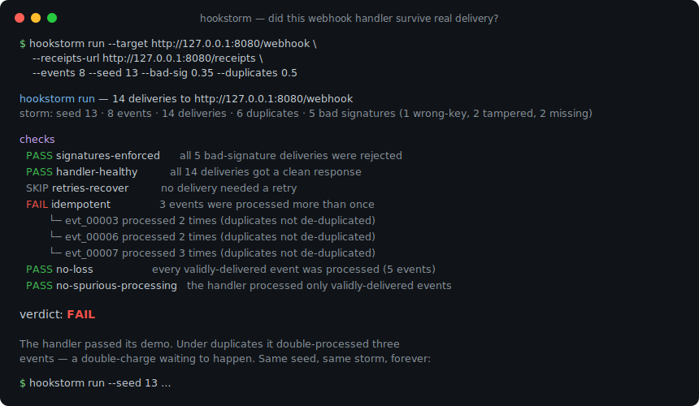
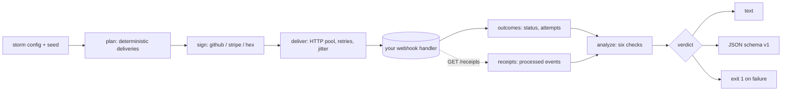

# hookstorm

[English](README.md) | [中文](README.zh.md) | [日本語](README.ja.md)

[](LICENSE) [](go.mod) [](CHANGELOG.md)  [](CONTRIBUTING.md)

**hookstorm — 重複・リトライ・順序入れ替え・低速配信・不正な署名で webhook ハンドラーに負荷をかける。送信側に偏ったツールが誰も手をつけない、webhook の受信側をテストする。**



```bash
git clone https://github.com/JaydenCJ/hookstorm && cd hookstorm
go build -o hookstorm ./cmd/hookstorm    # single static binary, stdlib only
```

> プレリリース：v0.1.0 はまだパッケージレジストリにタグ付けされていません。上記のとおりソースからビルドしてください（Go ≥1.22 なら何でも可）。

## なぜ hookstorm なのか？

webhook ハンドラーはデモは通るのに本番で壊れる。本番はデモではないからだ。同じイベントが二度届き、リトライが順序を崩して着地し、配信が遅れ、署名が間違っている。長年の「webhook の落とし穴」記事はまさにこれをバックエンド開発者に警告してきたが、どの webhook ツールも向きが逆だ。Stripe の `stripe listen`、各社のフォワーダー、ngrok、webhook.site はイベントを*送る*か*覗く*のを助け、Svix や Hookdeck のような送信基盤は*自分たちの*配信を保証する。どれもあなたのハンドラーを壊す厄介な配信セマンティクスで*あなたの*ハンドラーを攻撃しない。hookstorm はそれをやる。シードから決定論的なストームを組み立て——重複、順序入れ替え、ジッター、そして誤鍵 / 改ざん / 欠落の署名——それをエンドポイントに撃ち込み、判定を返す。不正な署名は拒否されたか、ハンドラーは持ちこたえたか、そして（レシート用エンドポイントを公開していれば）各イベントはちょうど一度処理され、失われず、余計なものもなかったか。ストームはシードで決まるので、失敗はひとつの数字から永遠に再現できる。

| | hookstorm | Stripe CLI / 各社フォワーダー | webhook.site / ngrok | Svix / Hookdeck |
|---|---|---|---|---|
| 重複・リトライ・順序入れ替え・低速配信を注入 | ✅ | ❌ | ❌ | ❌ |
| 不正な署名を送信（誤鍵・改ざん・欠落） | ✅ | ❌ | ❌ | ❌ |
| **あなたの**ハンドラー（受信側）をテスト | ✅ | ⚠️ 実イベントを転送 | ⚠️ 閲覧のみ | ❌ 送信側 |
| 冪等性 / 欠落なし の判定 | ✅ | ❌ | ❌ | ❌ |
| 署名バイパスの検出 | ✅ | ❌ | ❌ | ❌ |
| シードから決定論的に再現可能 | ✅ | ❌ | ❌ | ❌ |
| オフライン・アカウント不要・実行時依存ゼロ | ✅ | ❌ | ❌ | ❌ |

<sub>2026-07-13 時点での各ツールの公表された用途に照らして確認。hookstorm は Go 標準ライブラリのみを取り込む。他はホスト型サービスか、独自の依存ツリーを持つ SDK である。</sub>

## 機能

- **本物の配信セマンティクスを意図的に再現** — 重複（少なくとも一度）、有界ウィンドウ内での順序入れ替え、配信ごとのジッター、5xx からのリトライを、すべて単一のシードから。
- **本当に不正な署名** — 誤鍵・本文改ざん・ヘッダー欠落の配信を、GitHub・Stripe・素の hex 形式で本物の HMAC-SHA256 により署名するので、検証を省いたハンドラーは現行犯で捕まる。
- **ログではなく判定** — 6 つのブラックボックス検査（署名強制・ハンドラー健全・リトライ回復・冪等・欠落なし・余計な処理なし）を、それぞれ PASS / FAIL / SKIP で、失敗ごとに引用付きの証拠を添えて返す。
- **証明できる冪等性** — `--receipts-url` をハンドラーが処理した内容を列挙するエンドポイントに向ければ、送った重複にもかかわらず各イベントがちょうど一度コミットされたことを hookstorm が証明する。
- **永遠に再現可能** — 各ストームはそのシードとフラグの純粋関数だ。`hookstorm plan` は正確な配信一覧をオフラインで出力し、グリーンの実行はどのマシンでもバイト単位で同一になる。
- **CI 対応のゲート** — 検査が失敗した瞬間に `hookstorm run` は 1 で終了し、パイプライン向けに安定した JSON（`schema_version: 1`）を出す。
- **依存ゼロ・完全オフライン** — Go 標準ライブラリのみ。何もリッスンせず、外部へ何も送らず、渡した `--target` とだけ通信する。

## クイックスタート

```bash
# build the demo target: a correct webhook handler on loopback
go build -o reference-handler ./examples/reference-handler
./reference-handler --addr 127.0.0.1:8080 --mode correct &

# storm it: duplicates, reordering, and bad signatures, reproducible from --seed
./hookstorm run --target http://127.0.0.1:8080/webhook \
  --receipts-url http://127.0.0.1:8080/receipts \
  --events 8 --seed 13 --bad-sig 0.35 --duplicates 0.5
```

実際に捕捉した出力 — 正しいハンドラーは全検査を通過する：

```text
hookstorm run — 14 deliveries to http://127.0.0.1:8080/webhook
storm: seed 13 · 8 events · 14 deliveries · 6 duplicates · 5 bad signatures (1 wrong-key, 2 tampered, 2 missing)

checks
  PASS signatures-enforced      all 5 bad-signature deliveries were rejected
  PASS handler-healthy          all 14 deliveries got a clean response
  SKIP retries-recover          no delivery needed a retry
  PASS idempotent               every validly-delivered event was processed at most once (5 events)
  PASS no-loss                  every validly-delivered event was processed (5 events)
  PASS no-spurious-processing   the handler processed only validly-delivered events

verdict: PASS
```

同じストームを、重複排除を忘れたハンドラー（`--mode non-idempotent`）に向けると、hookstorm は二重処理を捕まえ、終了コード 1 を返す：

```text
checks
  PASS signatures-enforced      all 5 bad-signature deliveries were rejected
  PASS handler-healthy          all 14 deliveries got a clean response
  SKIP retries-recover          no delivery needed a retry
  FAIL idempotent               3 events were processed more than once
         └─ evt_00003 processed 2 times (duplicates not de-duplicated)
         └─ evt_00006 processed 2 times (duplicates not de-duplicated)
         └─ evt_00007 processed 3 times (duplicates not de-duplicated)
  PASS no-loss                  every validly-delivered event was processed (5 events)
  PASS no-spurious-processing   the handler processed only validly-delivered events

verdict: FAIL
```

## 署名方式

hookstorm は実際のプロバイダーと同じく、HMAC-SHA256 と定数時間比較で配信に署名する——詳細は [docs/signatures.md](docs/signatures.md) を参照。

| 方式 | ヘッダー | 署名対象のペイロード | ヘッダー値 |
|---|---|---|---|
| `github` | `X-Hub-Signature-256` | 生の本文 | `sha256=<hex>` |
| `stripe` | `Stripe-Signature` | `<timestamp>.<body>` | `t=<unix>,v1=<hex>` |
| `hex` | `X-Signature` | 生の本文 | `<hex>` |

「不正な」配信とは `wrong-key`、`tampered`（署名後に本文を変更）、`missing`（ヘッダーなし）のいずれかだ。正しいハンドラーはこの 3 つをすべて 4xx で拒否しなければならない。

## 正しさの検査

各検査は外部から判定できる。後半の 3 つは `--receipts-url` エンドポイントを必要とし、なければ SKIP になる——[docs/checks.md](docs/checks.md) を参照。

| 検査 | レシート要否 | 捕まえるもの |
|---|---|---|
| `signatures-enforced` | 不要 | 署名を一切検証しないハンドラー |
| `handler-healthy` | 不要 | ストーム下でのクラッシュ・panic・タイムアウト |
| `retries-recover` | 不要 | 一時的な失敗のあと回復しないまま |
| `idempotent` | 必要 | 重複 / 再配信イベントの二重処理 |
| `no-loss` | 必要 | 順序入れ替えや負荷で静かに落とされたイベント |
| `no-spurious-processing` | 必要 | 拒否済みや未署名のイベントを処理した |

## CLI リファレンス

`hookstorm [run|plan|sign|version] [flags]`。終了コード：0 正常、1 判定失敗、2 用法エラー、3 実行時エラー。

| フラグ | デフォルト | 効果 |
|---|---|---|
| `--target` | — | ストームを撃ち込む webhook エンドポイント URL（`run`、必須） |
| `--events` | `12` | ストーム内の論理イベント数 |
| `--seed` | `1` | シード。同じシードはストームを正確に再現する |
| `--duplicates` | `0.3` | あるイベントが追加配信を得る確率 `[0,1]` |
| `--max-duplicates` | `2` | 重複させたイベントごとの追加配信の上限 |
| `--bad-sig` | `0.2` | 誤って署名される配信の割合 `[0,1]` |
| `--missing` | `0.34` | 不正な署名のうちヘッダーを省く割合 |
| `--reorder-window` | `4` | このサイズのウィンドウ内で配信をシャッフル |
| `--max-delay-ms` | `0` | 配信ごとのジッターの上限 |
| `--secret` | `whsec_hookstorm` | 署名鍵（`run`、`sign`） |
| `--scheme` | `github` | 署名方式：`github`、`stripe`、`hex` |
| `--concurrency` | `4` | 並列配信ワーカー数 |
| `--max-retries` | `2` | 5xx / 転送失敗時のリトライ回数 |
| `--timeout` | `10s` | リクエストごとのタイムアウト（例 `5s`） |
| `--receipts-url` | — | 処理済みイベントを列挙する GET エンドポイント |
| `--format` | `text` | `text` または `json` |

## 検証

このリポジトリは CI を同梱しない。上記の主張はすべてローカル実行で検証される：

```bash
go test ./...            # 89 deterministic tests, offline, < 5 s
bash scripts/smoke.sh    # end-to-end CLI check, prints SMOKE OK
```

## アーキテクチャ



## ロードマップ

- [x] v0.1.0 — 決定論的なストーム（重複・リトライ・順序入れ替え・ジッター・不正な署名）、3 つの署名方式、6 つの正しさ検査、text/JSON レポート、終了コードゲート、89 テスト + スモークスクリプト
- [ ] 捕捉したプロバイダーのペイロードファイルからイベントを読み込む（`--events-file`）
- [ ] 実プロバイダーのリトライとバックオフのスケジュールを再生
- [ ] キー単位の順序検査（`updated` より後に到達しても `created` が成立することを断言）
- [ ] HTTP POST 以外の追加トランスポート（生 TCP、gRPC）
- [ ] ハンドラー再起動時に再ストームする `--watch` モード

全リストは [open issues](https://github.com/JaydenCJ/hookstorm/issues) を参照。

## コントリビュート

issue・ディスカッション・pull request を歓迎します——ローカルの手順（フォーマット、vet、テスト、`SMOKE OK`）は [CONTRIBUTING.md](CONTRIBUTING.md) を参照。着手しやすい課題は [good first issue](https://github.com/JaydenCJ/hookstorm/issues?q=is%3Aissue+is%3Aopen+label%3A%22good+first+issue%22) にラベル付けされ、設計上の議論は [Discussions](https://github.com/JaydenCJ/hookstorm/discussions) にあります。

## ライセンス

[MIT](LICENSE)
