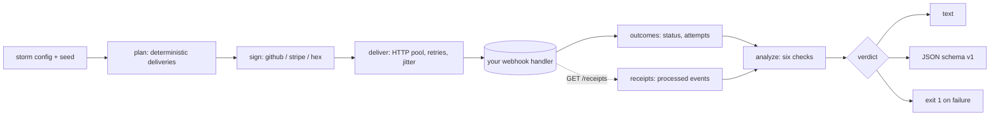

# hookstorm

[English](README.md) | [中文](README.zh.md) | [日本語](README.ja.md)

[](LICENSE) [](go.mod) [](CHANGELOG.md)  [](CONTRIBUTING.md)

**hookstorm — stress-tests webhook handlers with duplicates, retries, reordering, slow deliveries, and bad signatures. It tests the consumer side of webhooks, the niche every sender-focused tool ignores.**


```bash
git clone https://github.com/JaydenCJ/hookstorm && cd hookstorm
go build -o hookstorm ./cmd/hookstorm    # single static binary, stdlib only
```

> Pre-release: v0.1.0 is not tagged on a package registry yet; build from source as above (any Go ≥1.22).

## Why hookstorm?

Webhook handlers pass their demo and then break in production, because production is not a demo: the same event arrives twice, a retry lands out of order, a delivery is slow, a signature is wrong. Years of "webhook pitfall" blog posts warned backend developers about exactly this, yet every webhook tool points the wrong way — Stripe's `stripe listen`, provider forwarders, ngrok, and webhook.site all help you *send* or *inspect* events, and sending infrastructure like Svix or Hookdeck guarantees *their* delivery. None of them attack *your* handler with the nasty delivery semantics that break it. hookstorm does. It builds a deterministic storm from a seed — duplicates, reordering, jitter, and wrong-key / tampered / missing signatures — fires it at your endpoint, and returns a verdict: were bad signatures rejected, did the handler stay up, and (if it exposes a receipts endpoint) was every event processed exactly once, none lost, none spurious. Because the storm is seeded, a failure is reproducible forever from one number.

| | hookstorm | Stripe CLI / provider forwarders | webhook.site / ngrok | Svix / Hookdeck |
|---|---|---|---|---|
| Injects duplicates, retries, reordering, slow deliveries | ✅ | ❌ | ❌ | ❌ |
| Sends bad signatures (wrong-key, tampered, missing) | ✅ | ❌ | ❌ | ❌ |
| Tests **your** handler (the consumer) | ✅ | ⚠️ forwards real events | ⚠️ inspect only | ❌ sender side |
| Idempotency / no-loss verdict | ✅ | ❌ | ❌ | ❌ |
| Signature-bypass detection | ✅ | ❌ | ❌ | ❌ |
| Deterministic, reproducible from a seed | ✅ | ❌ | ❌ | ❌ |
| Offline, no account, zero runtime dependencies | ✅ | ❌ | ❌ | ❌ |

<sub>Comparison checked 2026-07-13 against each tool's documented purpose. hookstorm imports the Go standard library only; the others are hosted services or SDKs with their own dependency trees.</sub>

## Features

- **Real delivery semantics, on purpose** — duplicates (at-least-once), out-of-order arrival within a bounded window, per-delivery jitter, and 5xx-then-retry, all from one seed.
- **Bad signatures that are actually bad** — wrong-key, tampered-body, and missing-header deliveries signed with real HMAC-SHA256 in GitHub, Stripe, or bare-hex format, so a handler that skips verification is caught red-handed.
- **A verdict, not a log** — six black-box checks (signatures-enforced, handler-healthy, retries-recover, idempotent, no-loss, no-spurious) each PASS / FAIL / SKIP with quoted evidence for every failure.
- **Idempotency you can prove** — point `--receipts-url` at an endpoint listing what your handler processed, and hookstorm proves each event was committed exactly once despite the duplicates it sent.
- **Reproducible forever** — every storm is a pure function of its seed and flags; `hookstorm plan` prints the exact deliveries offline, and a green run is byte-identical on every machine.
- **CI-ready gate** — `hookstorm run` exits 1 the moment a check fails, with stable JSON (`schema_version: 1`) for pipelines.
- **Zero dependencies, fully offline** — Go standard library only; it binds nothing, phones nothing home, and talks only to the `--target` you give it.

## Quickstart

```bash
# build the demo target: a correct webhook handler on loopback
go build -o reference-handler ./examples/reference-handler
./reference-handler --addr 127.0.0.1:8080 --mode correct &

# storm it: duplicates, reordering, and bad signatures, reproducible from --seed
./hookstorm run --target http://127.0.0.1:8080/webhook \
  --receipts-url http://127.0.0.1:8080/receipts \
  --events 8 --seed 13 --bad-sig 0.35 --duplicates 0.5
```

Real captured output — a correct handler passes every check:

```text
hookstorm run — 14 deliveries to http://127.0.0.1:8080/webhook
storm: seed 13 · 8 events · 14 deliveries · 6 duplicates · 5 bad signatures (1 wrong-key, 2 tampered, 2 missing)

checks
  PASS signatures-enforced      all 5 bad-signature deliveries were rejected
  PASS handler-healthy          all 14 deliveries got a clean response
  SKIP retries-recover          no delivery needed a retry
  PASS idempotent               every validly-delivered event was processed at most once (5 events)
  PASS no-loss                  every validly-delivered event was processed (5 events)
  PASS no-spurious-processing   the handler processed only validly-delivered events

verdict: PASS
```

Now aim the same storm at a handler that forgets to de-duplicate (`--mode non-idempotent`) and hookstorm catches the double-processing, exit code 1:

```text
checks
  PASS signatures-enforced      all 5 bad-signature deliveries were rejected
  PASS handler-healthy          all 14 deliveries got a clean response
  SKIP retries-recover          no delivery needed a retry
  FAIL idempotent               3 events were processed more than once
         └─ evt_00003 processed 2 times (duplicates not de-duplicated)
         └─ evt_00006 processed 2 times (duplicates not de-duplicated)
         └─ evt_00007 processed 3 times (duplicates not de-duplicated)
  PASS no-loss                  every validly-delivered event was processed (5 events)
  PASS no-spurious-processing   the handler processed only validly-delivered events

verdict: FAIL
```

## Signature schemes

hookstorm signs deliveries the way real providers do, with HMAC-SHA256 and a constant-time compare — full details in [docs/signatures.md](docs/signatures.md).

| Scheme | Header | Signed payload | Header value |
|---|---|---|---|
| `github` | `X-Hub-Signature-256` | the raw body | `sha256=<hex>` |
| `stripe` | `Stripe-Signature` | `<timestamp>.<body>` | `t=<unix>,v1=<hex>` |
| `hex` | `X-Signature` | the raw body | `<hex>` |

A "bad" delivery is one of `wrong-key`, `tampered` (body changed after signing), or `missing` (no header). A correct handler must reject all three with a 4xx.

## Correctness checks

Each check is decidable from the outside; the last three need a `--receipts-url` endpoint and otherwise SKIP — see [docs/checks.md](docs/checks.md).

| Check | Needs receipts | Catches |
|---|---|---|
| `signatures-enforced` | no | a handler that never verifies the signature |
| `handler-healthy` | no | crashes, panics, or timeouts under the storm |
| `retries-recover` | no | staying broken after a transient failure |
| `idempotent` | yes | double-processing duplicated / redelivered events |
| `no-loss` | yes | events silently dropped under reordering or load |
| `no-spurious-processing` | yes | acting on a rejected or unsigned event |

## CLI reference

`hookstorm [run|plan|sign|version] [flags]`. Exit codes: 0 ok, 1 verdict failed, 2 usage error, 3 runtime error.

| Flag | Default | Effect |
|---|---|---|
| `--target` | — | webhook endpoint URL to storm (`run`, required) |
| `--events` | `12` | number of logical events in the storm |
| `--seed` | `1` | seed; the same seed reproduces the storm exactly |
| `--duplicates` | `0.3` | probability an event gets extra deliveries `[0,1]` |
| `--max-duplicates` | `2` | cap on extra deliveries per duplicated event |
| `--bad-sig` | `0.2` | fraction of deliveries signed wrong `[0,1]` |
| `--missing` | `0.34` | fraction of bad signatures that omit the header |
| `--reorder-window` | `4` | shuffle deliveries within windows of this size |
| `--max-delay-ms` | `0` | upper bound on per-delivery jitter |
| `--secret` | `whsec_hookstorm` | signing secret (`run`, `sign`) |
| `--scheme` | `github` | signature scheme: `github`, `stripe`, or `hex` |
| `--concurrency` | `4` | parallel delivery workers |
| `--max-retries` | `2` | retries on 5xx / transport failure |
| `--timeout` | `10s` | per-request timeout, e.g. `5s` |
| `--receipts-url` | — | GET endpoint listing processed events |
| `--format` | `text` | `text` or `json` |

## Verification

This repository ships no CI; every claim above is verified by local runs:

```bash
go test ./...            # 89 deterministic tests, offline, < 5 s
bash scripts/smoke.sh    # end-to-end CLI check, prints SMOKE OK
```

## Architecture



## Roadmap

- [x] v0.1.0 — deterministic storms (duplicates, retries, reordering, jitter, bad signatures), three signature schemes, six correctness checks, text/JSON reports, exit-code gate, 89 tests + smoke script
- [ ] Load events from a captured provider payload file (`--events-file`)
- [ ] Replay a real provider's retry and backoff schedule
- [ ] Per-key ordering checks (assert `created` survives arriving after `updated`)
- [ ] Additional transports beyond HTTP POST (raw TCP, gRPC)
- [ ] A `--watch` mode that re-storms on handler restart

See the [open issues](https://github.com/JaydenCJ/hookstorm/issues) for the full list.

## Contributing

Issues, discussions and pull requests are welcome — see [CONTRIBUTING.md](CONTRIBUTING.md) for the local workflow (format, vet, tests, `SMOKE OK`). Good entry points are labelled [good first issue](https://github.com/JaydenCJ/hookstorm/issues?q=is%3Aissue+is%3Aopen+label%3A%22good+first+issue%22), and design questions live in [Discussions](https://github.com/JaydenCJ/hookstorm/discussions).

## License

[MIT](LICENSE)
