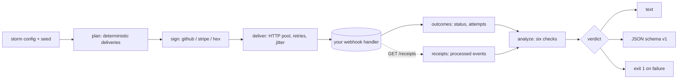

# hookstorm

[English](README.md) | [中文](README.zh.md) | [日本語](README.ja.md)

[](LICENSE) [](go.mod) [](CHANGELOG.md)  [](CONTRIBUTING.md)

**hookstorm —— 用重复投递、重试、乱序、慢速投递和错误签名对 webhook 处理器做压力测试。它测试的是 webhook 的消费端，也就是每个以发送方为中心的工具都忽略的空白地带。**


```bash
git clone https://github.com/JaydenCJ/hookstorm && cd hookstorm
go build -o hookstorm ./cmd/hookstorm    # single static binary, stdlib only
```

> 预发布：v0.1.0 尚未在任何软件包注册表打标签；请按上面的方式从源码构建（任意 Go ≥1.22）。

## 为什么选择 hookstorm？

Webhook 处理器能通过演示，却在生产环境里出问题，因为生产不是演示：同一个事件到达两次，一次重试乱序落地，一次投递很慢，一个签名是错的。多年来的“webhook 陷阱”博客一直在提醒后端开发者的正是这些，然而每个 webhook 工具都指向了错误的方向——Stripe 的 `stripe listen`、各家转发器、ngrok、webhook.site 帮你*发送*或*查看*事件，而 Svix、Hookdeck 这类发送基础设施保证的是*它们自己*的投递。它们都不会用那些真正压垮你处理器的糟糕投递语义去攻击*你的*处理器。hookstorm 会。它从一个种子构建出确定性的风暴——重复、乱序、抖动，以及错误密钥 / 被篡改 / 缺失的签名——把它打向你的端点，然后给出判定：错误签名是否被拒绝、处理器是否撑住，以及（如果它暴露了回执端点）每个事件是否恰好被处理一次、无丢失、无多余。因为风暴由种子决定，一次失败永远可以从一个数字复现。

| | hookstorm | Stripe CLI / 各家转发器 | webhook.site / ngrok | Svix / Hookdeck |
|---|---|---|---|---|
| 注入重复、重试、乱序、慢速投递 | ✅ | ❌ | ❌ | ❌ |
| 发送错误签名（错误密钥、被篡改、缺失） | ✅ | ❌ | ❌ | ❌ |
| 测试**你的**处理器（消费端） | ✅ | ⚠️ 转发真实事件 | ⚠️ 仅查看 | ❌ 发送端 |
| 幂等 / 不丢失 的判定 | ✅ | ❌ | ❌ | ❌ |
| 签名绕过检测 | ✅ | ❌ | ❌ | ❌ |
| 由种子决定、可复现 | ✅ | ❌ | ❌ | ❌ |
| 离线、无需账号、零运行时依赖 | ✅ | ❌ | ❌ | ❌ |

<sub>对照 2026-07-13 时各工具的既定用途核对。hookstorm 仅引入 Go 标准库；其余为托管服务或带有各自依赖树的 SDK。</sub>

## 功能

- **刻意重现真实投递语义** —— 重复（至少一次）、有界窗口内的乱序到达、逐条投递的抖动，以及 5xx 后重试，全部来自同一个种子。
- **货真价实的错误签名** —— 错误密钥、被篡改正文、缺失请求头三种投递，均以 GitHub、Stripe 或裸十六进制格式用真实 HMAC-SHA256 签名，因此跳过校验的处理器会被当场抓获。
- **给出判定，而非日志** —— 六项黑盒检查（签名强制、处理器健康、重试恢复、幂等、不丢失、无多余），每项 PASS / FAIL / SKIP，并为每次失败附上引用证据。
- **可证明的幂等性** —— 把 `--receipts-url` 指向一个列出处理器已处理内容的端点，hookstorm 就能证明：尽管发送了那些重复，每个事件仍被恰好提交一次。
- **永远可复现** —— 每场风暴都是其种子与参数的纯函数；`hookstorm plan` 离线打印出确切的投递清单，一次绿色运行在每台机器上都逐字节一致。
- **可用于 CI 的闸门** —— 一旦某项检查失败，`hookstorm run` 立即以 1 退出，并提供稳定的 JSON（`schema_version: 1`）供流水线使用。
- **零依赖、完全离线** —— 仅用 Go 标准库；它不监听任何东西、不向外回传，只与你给定的 `--target` 通信。

## 快速上手

```bash
# build the demo target: a correct webhook handler on loopback
go build -o reference-handler ./examples/reference-handler
./reference-handler --addr 127.0.0.1:8080 --mode correct &

# storm it: duplicates, reordering, and bad signatures, reproducible from --seed
./hookstorm run --target http://127.0.0.1:8080/webhook \
  --receipts-url http://127.0.0.1:8080/receipts \
  --events 8 --seed 13 --bad-sig 0.35 --duplicates 0.5
```

真实捕获的输出 —— 正确的处理器通过每一项检查：

```text
hookstorm run — 14 deliveries to http://127.0.0.1:8080/webhook
storm: seed 13 · 8 events · 14 deliveries · 6 duplicates · 5 bad signatures (1 wrong-key, 2 tampered, 2 missing)

checks
  PASS signatures-enforced      all 5 bad-signature deliveries were rejected
  PASS handler-healthy          all 14 deliveries got a clean response
  SKIP retries-recover          no delivery needed a retry
  PASS idempotent               every validly-delivered event was processed at most once (5 events)
  PASS no-loss                  every validly-delivered event was processed (5 events)
  PASS no-spurious-processing   the handler processed only validly-delivered events

verdict: PASS
```

现在把同一场风暴打向一个忘记去重的处理器（`--mode non-idempotent`），hookstorm 抓到了重复处理，退出码 1：

```text
checks
  PASS signatures-enforced      all 5 bad-signature deliveries were rejected
  PASS handler-healthy          all 14 deliveries got a clean response
  SKIP retries-recover          no delivery needed a retry
  FAIL idempotent               3 events were processed more than once
         └─ evt_00003 processed 2 times (duplicates not de-duplicated)
         └─ evt_00006 processed 2 times (duplicates not de-duplicated)
         └─ evt_00007 processed 3 times (duplicates not de-duplicated)
  PASS no-loss                  every validly-delivered event was processed (5 events)
  PASS no-spurious-processing   the handler processed only validly-delivered events

verdict: FAIL
```

## 签名方案

hookstorm 像真实提供方那样为投递签名，使用 HMAC-SHA256 与常量时间比较——完整细节见 [docs/signatures.md](docs/signatures.md)。

| 方案 | 请求头 | 被签名的载荷 | 请求头取值 |
|---|---|---|---|
| `github` | `X-Hub-Signature-256` | 原始正文 | `sha256=<hex>` |
| `stripe` | `Stripe-Signature` | `<timestamp>.<body>` | `t=<unix>,v1=<hex>` |
| `hex` | `X-Signature` | 原始正文 | `<hex>` |

一次“错误”投递是 `wrong-key`、`tampered`（签名后改动正文）或 `missing`（无请求头）之一。正确的处理器必须以 4xx 拒绝这三种。

## 正确性检查

每项检查都可从外部判定；后三项需要 `--receipts-url` 端点，否则跳过——见 [docs/checks.md](docs/checks.md)。

| 检查 | 需要回执 | 能抓到 |
|---|---|---|
| `signatures-enforced` | 否 | 从不校验签名的处理器 |
| `handler-healthy` | 否 | 风暴下的崩溃、panic 或超时 |
| `retries-recover` | 否 | 瞬时失败后始终不恢复 |
| `idempotent` | 是 | 对重复 / 重投事件的重复处理 |
| `no-loss` | 是 | 乱序或负载下被悄悄丢弃的事件 |
| `no-spurious-processing` | 是 | 处理了被拒绝或未签名的事件 |

## 命令行参考

`hookstorm [run|plan|sign|version] [flags]`。退出码：0 正常，1 判定失败，2 用法错误，3 运行时错误。

| 参数 | 默认值 | 作用 |
|---|---|---|
| `--target` | — | 要施加风暴的 webhook 端点 URL（`run`，必填） |
| `--events` | `12` | 风暴中的逻辑事件数量 |
| `--seed` | `1` | 种子；相同种子精确复现同一场风暴 |
| `--duplicates` | `0.3` | 某事件获得额外投递的概率 `[0,1]` |
| `--max-duplicates` | `2` | 每个被重复事件的额外投递上限 |
| `--bad-sig` | `0.2` | 被错误签名的投递比例 `[0,1]` |
| `--missing` | `0.34` | 错误签名中省略请求头的比例 |
| `--reorder-window` | `4` | 在此大小的窗口内打乱投递 |
| `--max-delay-ms` | `0` | 逐条投递抖动的上限 |
| `--secret` | `whsec_hookstorm` | 签名密钥（`run`、`sign`） |
| `--scheme` | `github` | 签名方案：`github`、`stripe` 或 `hex` |
| `--concurrency` | `4` | 并行投递工作协程数 |
| `--max-retries` | `2` | 5xx / 传输失败时的重试次数 |
| `--timeout` | `10s` | 单次请求超时，如 `5s` |
| `--receipts-url` | — | 列出已处理事件的 GET 端点 |
| `--format` | `text` | `text` 或 `json` |

## 验证

本仓库不附带任何 CI；上述每条主张都由本地运行来验证：

```bash
go test ./...            # 89 deterministic tests, offline, < 5 s
bash scripts/smoke.sh    # end-to-end CLI check, prints SMOKE OK
```

## 架构



## 路线图

- [x] v0.1.0 —— 确定性风暴（重复、重试、乱序、抖动、错误签名）、三种签名方案、六项正确性检查、text/JSON 报告、退出码闸门、89 项测试 + 冒烟脚本
- [ ] 从捕获的提供方载荷文件加载事件（`--events-file`）
- [ ] 复放某个真实提供方的重试与退避节奏
- [ ] 按键顺序检查（断言 `created` 在晚于 `updated` 到达时仍成立）
- [ ] 除 HTTP POST 之外的更多传输（裸 TCP、gRPC）
- [ ] 处理器重启后自动重新施加风暴的 `--watch` 模式

完整清单见 [open issues](https://github.com/JaydenCJ/hookstorm/issues)。

## 贡献

欢迎提交 issue、参与讨论与 pull request —— 本地工作流（格式化、vet、测试、`SMOKE OK`）见 [CONTRIBUTING.md](CONTRIBUTING.md)。适合上手的任务标记为 [good first issue](https://github.com/JaydenCJ/hookstorm/issues?q=is%3Aissue+is%3Aopen+label%3A%22good+first+issue%22)，设计问题请到 [Discussions](https://github.com/JaydenCJ/hookstorm/discussions)。

## 许可证

[MIT](LICENSE)
